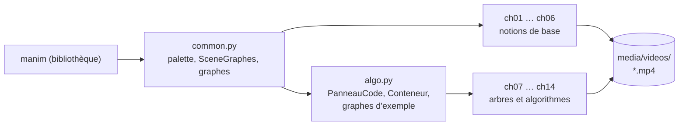
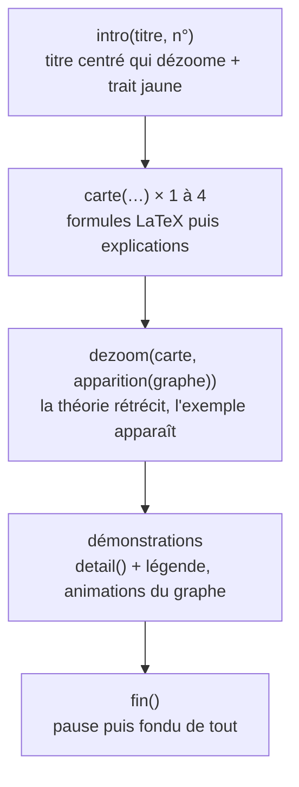

# Architecture de revisions-maths

Ce document décrit comment le projet est construit : l'organisation des fichiers, le rôle de chaque module, le schéma commun à tous les chapitres, et la marche à suivre pour en ajouter un.

## 1. Vue d'ensemble

Le projet est une collection de **scènes Manim** (une par chapitre) qui partagent deux modules d'outils. Il n'y a ni serveur, ni base de données, ni interface : le « produit » est un ensemble de vidéos.



Règle de dépendance : `common.py` ne dépend que de Manim ; `algo.py` dépend de `common.py` ; les chapitres 1 à 6 n'importent que `common.py`, les chapitres 7 à 14 importent aussi `algo.py`. Aucun chapitre n'importe un autre chapitre.

## 2. Arborescence

```text
revisions-maths/
├── graphs_algos/            # tout le code source
│   ├── common.py
│   ├── algo.py
│   ├── ch01_definition.py       ch02_types.py          ch03_degre.py
│   ├── ch04_chemins_cycles.py   ch05_connexite.py      ch06_representations.py
│   ├── ch07_arbres.py           ch08_bfs.py            ch09_dfs.py
│   ├── ch10_dijkstra.py         ch11_kruskal.py        ch12_prim.py
│   └── ch13_bellman_ford.py     ch14_pagerank.py
├── media/
│   └── videos/<chapitre>/480p15/*.mp4   # seul élément de media/ versionné
├── pyproject.toml  uv.lock  .python-version   # environnement (uv)
├── manim.cfg                                   # configuration Manim (vide de réglages)
├── README.md  ARCHITECTURE.md  LICENSE
└── .gitignore
```

Les scènes se lancent **depuis la racine** : `uv run manim -ql graphs_algos/ch08_bfs.py ParcoursLargeur`. Manim ajoute le dossier du script à `sys.path`, ce qui permet les imports `from common import *` et `from algo import *` sans package.

### Correspondance fichier ↔ scène

| Fichier | Classe de scène | Modules importés |
|---|---|---|
| `ch01_definition.py` | `Definition` | `common` |
| `ch02_types.py` | `Types` | `common` |
| `ch03_degre.py` | `Degre` | `common` |
| `ch04_chemins_cycles.py` | `CheminsCycles` | `common` |
| `ch05_connexite.py` | `Connexite` | `common` |
| `ch06_representations.py` | `Representations` | `common` |
| `ch07_arbres.py` | `Arbres` | `common`, `algo` (graphe d'exemple) |
| `ch08_bfs.py` | `ParcoursLargeur` | `algo` |
| `ch09_dfs.py` | `ParcoursProfondeur` | `algo` |
| `ch10_dijkstra.py` | `Dijkstra` | `algo` |
| `ch11_kruskal.py` | `Kruskal` | `algo` |
| `ch12_prim.py` | `Prim` | `algo` |
| `ch13_bellman_ford.py` | `BellmanFord` | `algo` |
| `ch14_pagerank.py` | `PageRank` | `algo` |

Les modules `algo` ré-exportent `common` (`from common import *`), d'où l'unique `from algo import *` des chapitres 8 à 14.

## 3. Le schéma d'un chapitre

Toutes les scènes héritent de `SceneGraphes` (dans `common.py`) et suivent la même suite d'étapes :



1. **`intro`** — le titre s'écrit au centre (avec « CHAPITRE N »), puis dézoome vers le haut ; un trait jaune se déploie dessous. Renvoie le titre ; le trait est mémorisé dans `self.trait_titre`.
2. **`carte`** — affiche un en-tête, écrit chaque formule (`Tex`), puis fait apparaître les explications une à une. Les cartes intermédiaires sont retirées avec `FadeOut` ; la dernière est passée à `dezoom`.
3. **`dezoom`** — la dernière carte se réduit à 10 % et devient transparente pendant que l'exemple concret apparaît (`apparition`).
4. **Démonstrations** — deux zones de texte coexistent : la **légende** (bas de l'écran, titre de la section en cours, changée par `changer`) et le **détail** (phrase explicative de l'étape, changée par `detail`).
5. **`fin`** — courte pause puis fondu de tous les objets de la scène.

## 4. `common.py` — la boîte à outils de base

### Palette

| Constante | Valeur | Usage |
|---|---|---|
| `FOND` | `#000000` | fond de toutes les scènes |
| `TEXTE`, `NOEUD`, `LIEN` (`BLANC`) | `#FFFFFF` | textes, sommets et arêtes au repos |
| `SOMMET` | `#38BDF8` (bleu) | mot « sommet », sommet « choisi / en cours » |
| `ACCENT` | `#FBBF24` (jaune) | mise en avant, arêtes retenues, trait de titre |
| `VERT`, `ROUGE`, `VIOLET` | `#4ADE80`, `#F87171`, `#A78BFA` | « fixé / bon », « écarté / erreur », troisième catégorie |
| `ARETE` | `#94A3B8` (gris) | notes secondaires, cadres, cases à zéro |

### Textes

| Fonction | Rôle |
|---|---|
| `texte(contenu, taille, cles, couleur)` | `Text` Pango avec mots clés colorés et en gras. `cles` : liste (jaune) ou `{mot: couleur}` |
| `tex(contenu, taille, cles, couleur)` | `Tex` LaTeX (formules entre `$…$`), mêmes `cles` |

### Graphes

| Fonction | Rôle |
|---|---|
| `creer_graphe(sommets, aretes, positions, orientee, rayon, couleur)` | `Graph` ou `DiGraph` à sommets étiquetés (`LabeledDot`), sommets au-dessus des arêtes |
| `positions_cercle(...)` | dispose les sommets sur un cercle |
| `apparition(g)` | animation : sommets un à un, puis arêtes |
| `parties(g)` | sommets et arêtes comme objets indépendants (pour `FadeOut`, `ReplacementTransform`) |
| `arete(g, u, v)` | arête `u–v` quel que soit l'ordre de déclaration |
| `colorier(g, v, couleur)` | change le **fond** du sommet sans repeindre sa lettre |
| `etiquette_poids(g, u, v, valeur)` | poids au milieu d'une arête, sur un fond qui masque le trait |

### `SceneGraphes`

| Méthode | Rôle |
|---|---|
| `intro(titre, numero)` | ouverture du chapitre |
| `carte(titre, couleur, formules, explications)` | page de théorie |
| `dezoom(theorie, *animations, duree)` | transition théorie → exemple |
| `legende(contenu, cles)` / `changer(ancien, nouveau)` | légende du bas et son remplacement (l'ancienne sort avant que la nouvelle n'entre) |
| `detail(ancien, contenu, cles)` | phrase d'explication, centrée en `CENTRE_DETAIL = (0, −2,55)` |
| `fin(pause)` | fondu final (ignoré avec `-s` pour garder l'image finale) |

## 5. `algo.py` — animer un algorithme

### `PanneauCode`

Pseudo-code numéroté dans un cadre, avec un **surligneur** qui se déplace de ligne en ligne.

- Construction : `PanneauCode(titre, lignes, coin, largeur_max, …)` où `lignes` est une liste de `(niveau d'indentation, texte)`.
- `montrer()` / `cacher()` : animations d'entrée et de sortie.
- `aller_a(i)` : animation qui place le surligneur sur la ligne `i` (numérotée à partir de 0).
- Les mots-clés (`tant que`, `pour chaque`, `si`, `marquer`, `enfiler`…) sont colorés par `CLES_CODE`.

### `Conteneur`

Une **file** (horizontale) ou une **pile** (verticale) dont les cases entrent et sortent.

- `ajouter(nom, couleur)` : enfile / empile ; `retirer(fin=False)` : défile le premier, ou dépile le dernier avec `fin=True`.
- Ces méthodes **renvoient des listes d'animations** : l'appelant les joue avec d'autres animations dans un même `self.play(...)`.

### Graphes d'exemple partagés

| Constantes | Utilisées par | Particularité |
|---|---|---|
| `SOMMETS_P`, `ARETES_P`, `VOISINS_P`, `POSITION_P` | ch07, ch08, ch09 | 6 sommets ; l'arête E–F ferme un cycle |
| `SOMMETS_M`, `ARETES_M`, `POS_M` | ch11, ch12 | 6 sommets pondérés, poids tous distincts (ACM unique) |
| `boite_arete(u, v, w)` | ch11, ch12 | case « arête + poids » |

### Principe : l'animation suit le vrai calcul

Pour chaque algorithme, la méthode `executer()` **exécute réellement l'algorithme en Python** (ensembles de sommets marqués, file, distances, composantes) et émet les animations au fil du calcul. L'animation ne peut donc pas contredire l'algorithme : les distances de Dijkstra, l'ordre de visite du DFS ou les arêtes rejetées par Kruskal sont calculés, pas écrits à la main. Les numéros de ligne passés à `aller_a` correspondent aux listes `LIGNES_*` de chaque chapitre.

Chapitre 10 : `executer()` est **générique** (une fonction `etiqueter` et un panneau de code facultatif) et sert à la fois pour le graphe d'étude et pour l'exemple Paris → Nice, qui n'affiche pas de pseudo-code.

Chapitre 13 : `executer(g, sommets, arcs, source, etiqueter, code, detaille)` est lui aussi générique : il sert au graphe d'étude (détaillé) et au petit graphe à cycle négatif (mode rapide). Il calcule les passes de Bellman-Ford pour de vrai, garde l'historique des distances pour le tableau « une ligne par passe », et sa passe de contrôle détecte réellement le cycle.

Chapitre 14 : les scores affichés viennent d'une vraie **itération de puissance** (`suivant(r)` applique la formule PR_{k+1}(p) = (1 − d)/N + d · Σ PR_k(q)/L(q) avec d = 0,85) ; le score d'une page est représenté par un halo vert dont le rayon suit la valeur, plutôt que par la taille du sommet, afin que les flèches restent attachées aux sommets.

## 6. Mise en page à l'écran

Le cadre visible fait environ **14,2 × 8** unités Manim (origine au centre).

| Zone | Position approximative | Contenu |
|---|---|---|
| Titre + trait | y ≈ 3,6 et 3,05 | `intro` |
| Carte de théorie | en-tête y = 2,35 ; formules puis explications en dessous | `carte` |
| Graphe | x ∈ [−6,5 ; −1], y ∈ [−2 ; 2] | exemple |
| Panneau de code | coin haut-gauche (0,25–0,35 ; 2,25), largeur ≤ 6,4 (5,4 si une pile est affichée) | `PanneauCode` |
| File | sous le panneau, y = −1,85 | `Conteneur` horizontal |
| Pile | x = 6,2, de y = −1,45 vers le haut | `Conteneur` vertical |
| Détail | y = −2,55 | `detail` |
| Légende | y ≈ −3,35 | `legende` |

Tout texte pouvant dépasser x = ±7,1 est ramené à la bonne largeur avec `scale_to_fit_width`.

## 7. Rendu et fichiers produits

```text
uv run manim -ql graphs_algos/<fichier>.py <Scène>
   └─► media/
        ├── videos/<chapitre>/480p15/<Scène>.mp4      ← conservé dans Git
        ├── videos/<chapitre>/480p15/partial_movie_files/   ← ignoré
        ├── Tex/   (sources .tex, .dvi, .svg des formules)  ← ignoré
        ├── texts/ (SVG du texte Pango)                     ← ignoré
        └── images/ (images finales avec -s)                ← ignoré
```

`.gitignore` ne garde que `media/videos/*/480p15/*.mp4` : les autres qualités (1080p60…), les morceaux partiels, les SVG, les `.tex` et les images de test sont régénérables et restent hors du dépôt.

## 8. Contraintes techniques et choix de conception

| Sujet | Choix / piège |
|---|---|
| Texte courant | `Text` (Pango), sans LaTeX : rapide, accents natifs. |
| Formules | `Tex` en mode texte avec `$…$` (et non `MathTex`, dont l'environnement `align*` casse les `&`). Nécessite LaTeX. |
| Mots clés | Un mot clé ne doit jamais être contenu dans un autre (`"pair"` dans `"impair"`, `"si "` dans `"sinon si "`) : Manim lève « Ambiguous style ». |
| Symboles du pseudo-code | La police Consolas n'a pas `∅ ∪ ∈ ∉` (rectangles blancs). `← ≠ − ∞` fonctionnent. Employer des mots (« vide », « ajouter e à T »). |
| Couleur d'un sommet | Ne pas utiliser `set_fill` seul : la lettre est repeinte. Passer par `colorier`. |
| `Indicate` et `Transform` | Joués dans le même `play` sur le même objet, `Indicate` restaure l'état initial et annule la transformation : les jouer en deux temps. |
| Superpositions de texte | `changer` et `detail` enchaînent « sortie puis entrée » (`lag_ratio=1`) pour ne jamais superposer deux phrases. |
| Mode `-s` | `fin()` n'efface pas la scène, pour inspecter l'image finale. |

## 9. Ajouter un chapitre

1. Créer `graphs_algos/chNN_sujet.py` avec `from common import *` (ou `from algo import *` pour un algorithme).
2. Déclarer les constantes du graphe (sommets, arêtes, positions) en tête de fichier, ou réutiliser celles de `algo.py`.
3. Écrire une classe héritant de `SceneGraphes` avec :
   - une méthode `formules()` qui enchaîne des `carte(...)` et **renvoie la dernière** ;
   - `construct()` : `intro` → `formules()` → `dezoom(carte, apparition(g), FadeIn(legende))` → démonstrations → `fin()`.
4. Pour un algorithme : définir `LIGNES_*`, créer un `PanneauCode` (et un `Conteneur` si besoin), et écrire `executer()` qui calcule pour de vrai en émettant les animations.
5. Tester avec `-ql -s` (image finale), puis `-ql` ; extraire quelques images de la vidéo pour vérifier qu'aucun texte ne déborde.
6. Ajouter le chapitre aux tables du `README.md` et de ce document.

## 10. Branches Git

La branche **`graph_algo`** contient l'ensemble du projet. Le dépôt est prévu pour être découpé en plusieurs branches : chacune pourra repartir de `graphs_algos/common.py` et `graphs_algos/algo.py` (le socle commun) et ne garder que les chapitres qui la concernent, sans autre adaptation, puisque les chapitres ne dépendent pas les uns des autres.
